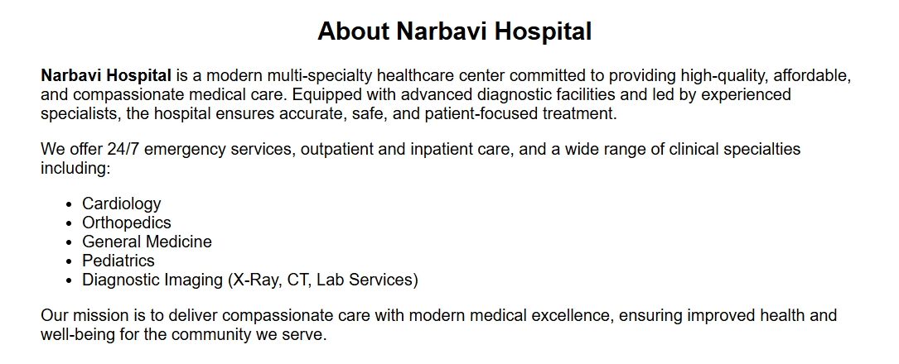

# Ex04 Places Around Me
## Date: 

## AIM
To develop a website to display details about the places around my house.

## DESIGN STEPS

### STEP 1
Create a Django admin interface.

### STEP 2
Download your city map from Google.

### STEP 3
Using ```<map>``` tag name the map.

### STEP 4
Create clickable regions in the image using ```<area>``` tag.

### STEP 5
Write HTML programs for all the regions identified.

### STEP 6
Execute the programs and publish them.

## CODE
```
map.html

<html>
<head>
<title>My City</title>
</head>
<body>
    <h1 align="center">KANCHIPURAM</h1>
    <h3 align="center">VEDHA M (25012201)</h3>
    
    
</body>


<map name="image-map">
    <area target="" alt="" title="" href="kamakshi amman temple south gopuram.html" coords="950,420,1223,509" shape="rect">
    <area target="" alt="" title="" href="kailasanatha temple.html" coords="54,293,316,396" shape="rect">
    <area target="" alt="" title="" href="hospital.html" coords="677,534,450,432" shape="rect">
    <area target="" alt="" title="" href="sri ulagalanda perumal temple.html" coords="1121,530,1380,627" shape="rect">
</map>
</head>
</html>

kamakshi amman temple.html

<!DOCTYPE html>
<html>
<head>
  <meta charset="UTF-8">
  <title>About Kamakshi Amman Temple</title>
  <style>
    body { font-family: Arial, sans-serif; background:#f4f4f4; padding:20px; }
    .card {
      max-width:700px; margin:auto; background:white; padding:20px;
      border-radius:10px; line-height:1.6;
    }
    img { width:100%; border-radius:8px; margin-bottom:15px; }
  </style>
</head>
<body>

<div class="card">
  <h1>Kamakshi Amman Temple</h1>

  <p>
    The Kamakshi Amman Temple, located in Kanchipuram, Tamil Nadu, is a major 
    Hindu shrine dedicated to Goddess Kamakshi, a form of Parvati. The temple 
    dates back to the Pallava period and was later enhanced by Chola and 
    Vijayanagara kings.
  </p>

  <p>
    Known for its classic Dravidian architecture, the temple features a sacred 
    sanctum where the goddess sits in a unique posture holding a sugarcane bow 
    and flower arrows. Its gopurams, especially the South Gopuram, showcase 
    beautiful carvings and traditional craftsmanship.
  </p>

  <p>
    The temple is one of the most important Shakti places of worship and remains 
    a vibrant center of festivals, rituals, and devotion.
  </p>
</div>

kailasanatha temple.html

</body>
</html>

<!DOCTYPE html>
<html>
<head>
  <meta charset="UTF-8">
  <title>About Kailasanatha Temple</title>
  <style>
    body { 
      font-family: Arial, sans-serif; 
      background: #f4f4f4; 
      padding: 20px; 
    }
    .container {
      max-width: 700px;
      margin: auto;
      background: white;
      padding: 20px;
      border-radius: 10px;
    }
    h1 { color: #444; }
    img { width: 100%; border-radius: 8px; margin-bottom: 15px; }
  </style>
</head>
<body>

<div class="container">
  <h1>Kailasanatha (Kailasa) Temple</h1>

  <p>
    The Kailasanatha Temple, also called the Kailasa Temple, is one of India’s most remarkable 
    architectural achievements. Located at the Ellora Caves in Maharashtra, it was built in the 
    8th century by the Rashtrakuta dynasty.
  </p>

  <p>
    What makes this temple unique is that it was carved entirely from a single rock using a 
    top-down technique. Dedicated to Lord Shiva, it symbolizes Mount Kailash and features 
    detailed carvings, a Nandi Mandapa, tall pillars, and sculptures from the Ramayana and 
    Mahabharata.
  </p>

  <p>
    Today, the Kailasa Temple is part of the UNESCO World Heritage Site at Ellora and is 
    admired for its scale, beauty, and engineering brilliance.
  </p>
</div>

</body>
</html>

hospital.html

<section id="about" style="max-width:800px;margin:auto;padding:20px;font-family:Arial;">
  <h2 style="text-align:center;">About Narbavi Hospital</h2>
  <p>
    <strong>Narbavi Hospital</strong> is a modern multi-specialty healthcare center committed to providing
    high-quality, affordable, and compassionate medical care. Equipped with advanced diagnostic
    facilities and led by experienced specialists, the hospital ensures accurate, safe, and patient-focused treatment.
  </p>
  <p>
    We offer 24/7 emergency services, outpatient and inpatient care, and a wide range of clinical specialties including:
  </p>

  <ul>
    <li>Cardiology</li>
    <li>Orthopedics</li>
    <li>General Medicine</li>
    <li>Pediatrics</li>
    <li>Diagnostic Imaging (X-Ray, CT, Lab Services)</li>
  </ul>

  <p>
    Our mission is to deliver compassionate care with modern medical excellence, ensuring improved
    health and well-being for the community we serve.
  </p>
</section>

sri ulagalanda perumal temple.html

<!DOCTYPE html>
<html>
<head>
  <meta charset="UTF-8">
  <title>Sri Ulagalanda Perumal Temple</title>
  <style>
    body { font-family: Arial; padding:20px; background:#f4f4f4; }
    .box { max-width:650px; margin:auto; background:white; padding:20px; border-radius:10px; }
    img { width:100%; border-radius:8px; margin-bottom:15px; }
  </style>
</head>
<body>

<div class="box">
  <h1>Sri Ulagalanda Perumal Temple</h1>

  <p>
    Sri Ulagalanda Perumal Temple, located in Kanchipuram, is a famous  
    Divya Desam dedicated to Lord Vishnu in his Trivikrama (Vamana) form.  
    The temple is known for its large idol of Lord Vishnu measuring around  
    35 feet, symbolizing his cosmic stride that covered the universe.
  </p>

  <p>
    Built by the Pallavas and later expanded by the Cholas, the temple  
    features classic Dravidian architecture, stone carvings, and ancient  
    inscriptions. It is an important pilgrimage site for Vaishnavites.
  </p>
</div>

</body>
</html>

```

## OUTPUT





## RESULT
The program for implementing image maps using HTML is executed successfully.
